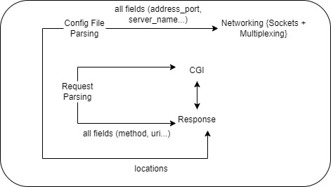

# HTTP Server in C++

This is an HTTP server implemented in C++98 from scratch that was completed as part of a 42 core curriculum, it is capable of handling GET, POST, and DELETE methods and it supports multiplexing to handle multiple connections concurrently.

## Features

- **GET Requests:** Retrieve information or resources from the server.
- **POST Requests:** Submit data to be processed to a specified resource.
- **DELETE Requests:** Delete a specified resource on the server.
- **Multiplexing:** Concurrently handle multiple client connections.

## Team

This project was developed by:

- [Kaoutar Moutaouakil/kmoutaou](https://github.com/Kate-77)
- [Fatima Ezzahra El Fil/fel-fil](https://github.com/zowaa)
- [Abdelkhalek Boutahri/abboutah](https://github.com/abboutah)

## Implementation Details



### Sockets

The server utilizes sockets to establish communication between clients and the server. Sockets provide a mechanism for processes on different devices to communicate over a network.

### HTTP Protocol

The HTTP protocol is used for communication between the server and clients. The server follows the HTTP/1.1 specification, supporting common methods such as GET, POST, and DELETE.

### Request Handling

The server parses incoming HTTP requests, extracts information such as the request method and target endpoint, and processes the request accordingly. This involves implementing handlers for GET, POST, and DELETE methods.

### Response Generation

Upon processing a request, the server generates an appropriate HTTP response. This includes constructing the response header with status codes, content type, and content length.

### Error Handling

The server includes error handling mechanisms to respond with meaningful error messages and appropriate status codes in case of invalid requests or server errors.

## Concepts

### HTTP Request

An HTTP request is a message sent by the client to the server, specifying an action to be performed. It includes a method (GET, POST, DELETE), a target (URI), and additional information such as headers and body.

### HTTP Response

An HTTP response is a message sent by the server to the client in response to an HTTP request. It includes a status code indicating the result of the request, headers providing additional information, and a message body containing the requested resource or an error message.


### Multiplexing

Multiplexing allows the server to handle multiple client connections concurrently. Each connection is processed independently in its own thread, ensuring efficient use of resources and responsiveness.

## Usage

1. Clone the repository:

   ```bash
   git clone https://github.com/Kate-77/WebServer.git
   ```

2. Build the server:
   ```bash
   make 
   ```

3. Run the server with default config file:
   ```bash
   ./webserv 
   ```

4. Run the server with a specific config file:
   ```bash
   ./webserv config_files/cgi_test.conf
   ```

5. Access the server in your web browser or use tools like curl and postman to send requests.